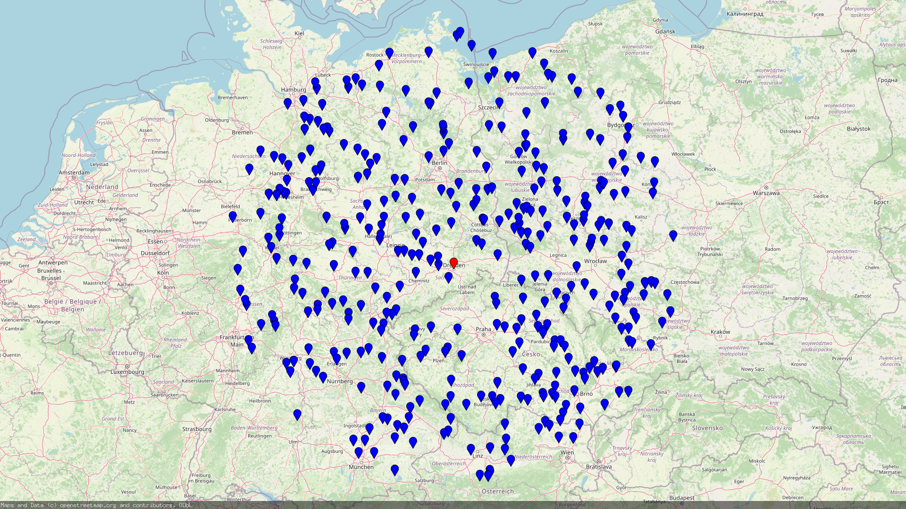

# Go SKNN

## What is Go-SKNN?
Go-SKNN is a spatial KNN search written in Go.
It allows to efficiently search for values with increasing distance to a given point.
Values are first added to the index and can be queried later.

## When should you use Go-SKNN?
Go-SKNN is useful when you have a large number of values, and you want to find the nearest values to a given point.
It can solve problems like:
- Find the nearest restaurants to a given location.
- Find all gas stations within a 10 km radius to a given location.
- Find the 10 nearest 4* hotels to a given location.

The image shows an example query. The red dot is the search point, and the blue dots are the returned values.
The values are sorted by distance to the search point. The index contained 500,000 values. 
The search query returned the 400 nrarest values for the location 51.0504, 13.7373


## Usage
```go
// Create the index. A precision of 14 is a good starting point.
index, err := NewKNN[int](14)
if err != nil {
    log.Fatalln("Error creating index:", err)
}

// Add the key "key-1" with the value 1 at the coordinates 51.0504, 13.7373.
index.AddValue("key-1", 1, 51.0504, 13.7373)
// Add the key "key-2" with the value 2 at the coordinates 40.7128, 74.0060
index.AddValue("key-2", 2, 40.7128, 74.0060)
// Add the key "key-3" with the value 3 at the coordinates 0.0, 0.0
index.AddValue("key-3", 3, 0, 0)

result := make([]int, 0, 2)
// Define the search function. This function will be called for each value found.
searchFunc := func(value *go_sknn.Value[int]) bool {
    // Add the value to the result.
    result = append(result, value.Value())
    // Stop the search after two values have been found.
    return len(result) >= 2
}

// Start the search at the coordinates 30.123, 10.123.
index.Search(context.Background(), 30.123, 10.123, searchFunc)

// Print the results. Output: [1 3]
fmt.Println(result)
```

## Filter Examples

### Distance
Example: Return all values within a distance of 100 km.
```go
var result []string
searchFunc := func(value *go_sknn.Value[int]) bool {
    // Stop if the distance is greater than 100km
    if value.DistanceKM(12.3, 45,6) > 100 {
        return true
    }
    // Else add the key to the result.
    result = append(result, value.Key())
    return false
}
```

### Filtering
Example: Return all blue values.
```go
var result []string
searchFunc := func(value *go_sknn.Value[int]) bool {
    // Only add blue values to the result. 
    if value.Value() == "blue" {
        result = append(result, value.Key())
    }
    return false
}
```

### Time
Example: Stop after 10ms.
```go
var result []string
ctx := context.WithTimeout(context.Background(), 10*time.Millisecond)
searchFunc := func(value *go_sknn.Value[int]) bool {
    result = append(result, value.Key())
    return ctx.Err() != nil
}
```
